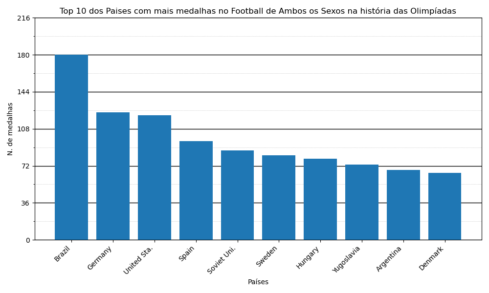

# Análise e Visualização de Dados das Olimpíadas

Este projeto em Python realiza a análise e visualização gráfica dos dados das Olimpíadas, permitindo gerar gráficos que mostram os países ou atletas com mais medalhas em modalidades específicas, filtrando por gênero e esporte.

---

## Funcionalidades

- Leitura do dataset das Olimpíadas em formato CSV.
- Filtragem dos dados por esporte, gênero (masculino, feminino ou ambos) e tipo (país ou atleta).
- Criação de gráficos de barras mostrando os top 10 países ou atletas com mais medalhas.
- Abreviação automática dos nomes para melhor visualização nos gráficos.
- Configuração dinâmica do título, rótulos e escala dos gráficos.
- Salvamento dos gráficos gerados em arquivo PDF.

---

## Requisitos

- Python 3.x
- Bibliotecas Python:
  - pandas
  - matplotlib
  - numpy

Você pode instalar as bibliotecas necessárias com:

pip install pandas matplotlib numpy

---

## Como usar

1. Coloque o arquivo `olympics_dataset.csv` no caminho especificado no código ou ajuste o caminho para o local correto do arquivo.

2. Execute o script Python:

python seu_script.py

3. Siga as instruções no terminal:

- Escolha se deseja gráfico de países ou atletas.
- **Digite o nome do esporte em inglês.**  
  > **Importante:** O filtro considera todos os esportes cujo nome contenha o texto digitado.  
  > Por exemplo, digitando `"basket"` o programa incluirá modalidades como `"basketball"` e `"basketball 3x3"`.  
  > Se desejar filtrar por uma modalidade específica, digite o nome completo, como `"basketball 3x3"`.
- Escolha o gênero dos atletas (masculino, feminino ou ambos).

4. O programa irá gerar e exibir um gráfico de barras com o top 10 dos países ou atletas com mais medalhas nas modalidades filtradas.

5. O gráfico também será salvo no arquivo `grafico.pdf` na pasta do projeto.

---

## Estrutura do código

- `abreviador(nome)`: função que abrevia nomes compostos para facilitar a visualização.
- Filtragem e criação da tabela dinâmica com contagem de medalhas.
- Geração do gráfico com matplotlib, incluindo configuração de ticks, grades e rótulos.

---

## Exemplo de uso

Digite 1 se deseja um gráfico de países com mais medalhas

Digite 2 se deseja um gráfico de atletas com mais medalha
1
Digite o nome do esporte que deseja fazer o gráfico EM INGLÊS: basket
Você escolheu Basket!
Digite 1 para fazer um gráfico de apenas atletas masculinos
Digite 2 para apenas femininos
Digite 3 para fazer ambos os gráficos
3

## Exemplo de gráfico gerado

Abaixo está um exemplo do gráfico gerado pelo programa:

